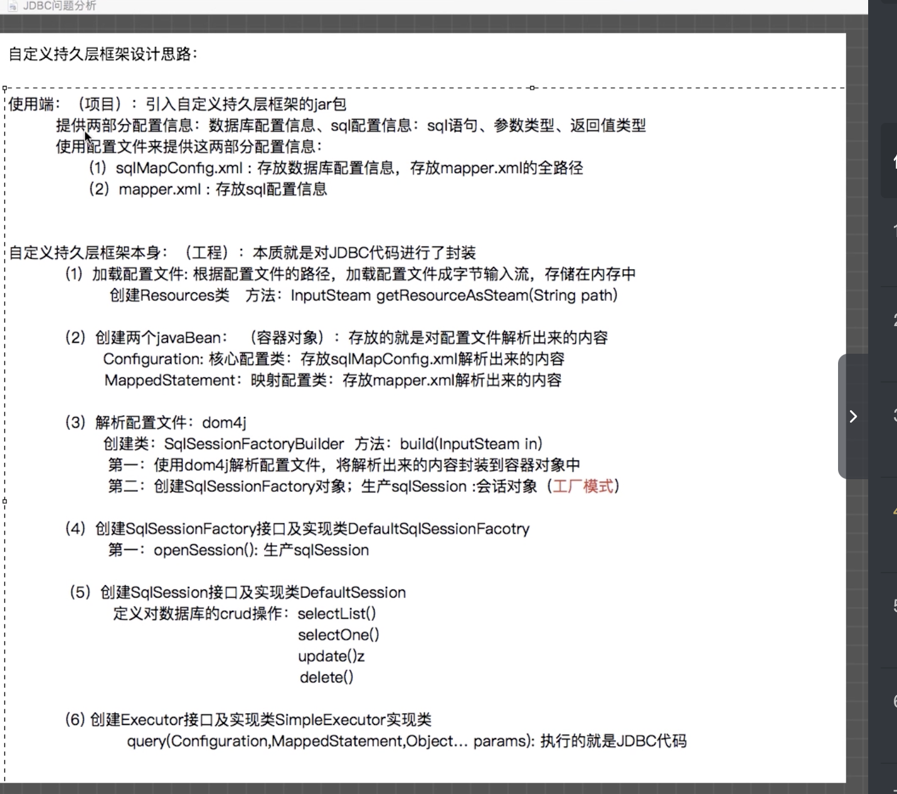

###自定义持久层框架设计思路
####使用端:(项目):引入自定义持久层框架的jar包  
提供两部分配置信息:  
1. 数据库配置信息: sqlMapConfig.xml,存放数据库配置信息,存放mapper.xml的全路径
2. sql配置信息: Mapper.xml,存放sql配置信息

####自定义持久层框架本身:(工程):本质就是对JDBC代码进行封装
1. 加载配置文件:  根据配置文件的路径,加载配置文件成字节输入流,存储在内存中
创建Resources类 方法: InputStream getResourceAsStream(String path)
2. 创建两个javaBean: (容器对象): 存放的就是对配置文件解析出来的内容  
Configuration: 核心配置类:存放sqlMapConfig.xml解析出来的内容
MappedStatement: 映射配置类: 存放mapper.xml解析出来的内容
3. 解析配置文件: dom4j  
创建类: SqlSessionFactoryBean 方法: build(InputStream in)  
第一: 使用dom4j解析配置文件,将解析出来的内容封装到容器对象中  
第二: 创建SqlSessionFactory对象,生产sqlSession: 会话对象(工厂模式)  
4. 创建SqlSessionFactory接口及实现类DefaultSqlSessionFactory  
第一: openSession(): 生产sqlSession
5. 创建SqlSession接口及实现类DefaultSession  
定义对数据库的CRUD操作: selectList() selectOne() update() delete()

6. 创建Executor接口及实现类SimpleExcutor实现类 quer(Configuration,MappedStatement,Object... params): 执行JDBC代码

